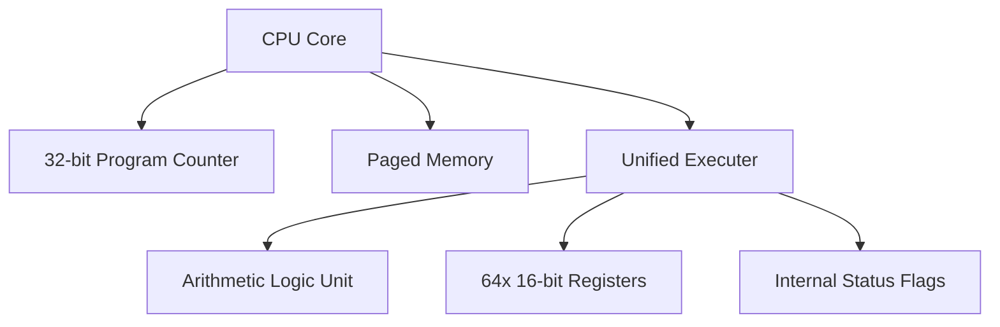

# WillVM Architecture

This document describes the internal structure of the WillVM virtual machine.

## High-Level Diagram

## Components

### 1. CPU (The Orchestrator)
The CPU manages the **Fetch-Decode-Execute** cycle. It fetches 4 binary words from Memory starting at the address stored in the PC, then hands them over to the Executer.

### 2. Unified Executer
The Executer replaces the traditional separate Decoder and Execution unit. 
- **Role**: Decodes Opcode bit-flags, resolves operand values (Register vs Immediate), and performs instruction logic.
- **Status Flags**: Maintains internal `zero`, `greater`, and `less` flags updated by `CMP` for conditional branching.

### 3. ALU (Arithmetic Logic Unit)
A stateless unit that performs pure mathematical and bitwise operations. It is used by the Executer for instructions like `ADD`, `SUB`, `XOR`, etc.

### 4. Memory Manager
Handles paged storage. It provides a `read(addr)` and `write(addr, val)` interface to the CPU and Executer.

### 5. Registers
A set of 64 general-purpose 16-bit registers usable by all arithmetic and logic instructions.
